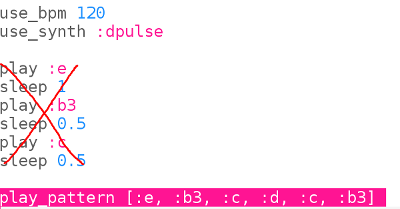
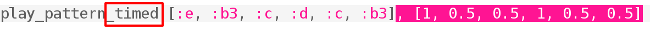
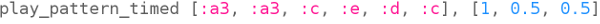

## برمجة البدء

الآن دعونا نبرمج الجزء الأول من اللحن في Sonic Pi.

+ أولاً دعونا نختار سرعة ومزامنة للموسيقى. السرعة العادية هي 60 نبضة في الدقيقة (bpm) ولكن هذا ليس بالسرعة الكافية لهذه القطعة.
    
    اختر مخزنًا مؤقتًا فارغًا في Sonic Pi وأضف هذا الكود:
    
    

+ إليك أول حانة في كوروبينيكي:
    
    
    
    ويبين اسم الملاحظة أدناه باللون الأحمر وطول الملاحظة أعلاه باللون الأخضر.
    
    تحتوي النوتات الموسيقية على أسماء حروف من A-G. للحصول على المزيد من الملاحظات ، كرر الحروف للحصول على المزيد من الأوكتافات (نطاقات الملاحظات الأعلى أو الأدنى). يبدأ كل أوكتاف من C.
    
    في Sonic Pi الافتراضي هو octave 4, b3 means b من octave أدناه.
    
    يسمح لك Sonic Pi باستخدام أسماء الأحرف بدلاً من الأرقام. هذا مفيد عندما تعمل مع المعنى الموسيقي.
    
    Code the first 3 notes of Korobeiniki in Sonic Pi:
    
    

+ That works but it takes quite a lot of typing. There's a shorter way to program longer tunes: `play_pattern`.
    
    `play_pattern` allows you to program multiple notes in one line.
    
    Replace your code to use `play_pattern` to play the first bar:
    
    

+ You might have noticed that the notes aren't actually all the same length. That's okay, if you change `play_pattern` to `play_pattern_timed` then you can say how long each note lasts.
    
    The numbers in green show many beats each note lasts.
    
    
    
    (If you read music, this piece is in 4/4 time and a crotchet lasts one beat, a quaver lasts half a beat and a minim lasts two beats.)
    
    `play_pattern_timed` takes a list of notes and then a list of times.
    
    Change your `play_pattern` code to look like this:
    
    

+ If you don't give enough times then Sonic Pi will repeat them. This bar repeats the timing `1, 0.5, 0.5` (crotchet, quaver, quaver) so you can change your code to:
    
    

+ Add the next bar of music, the timing is the same for this bar.
    
    
    
    
    
    

      <audio controls preload> <source src="resources/tetris-1.mp3" type="audio/mpeg"> Your browser does not support the <code>audio</code> element. </audio>
    

Is the tune starting to sound familiar?