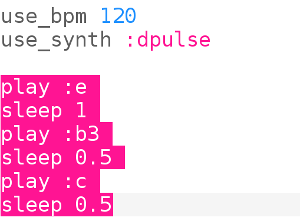

## برمجة البدء

الآن دعونا نبرمج الجزء الأول من اللحن في Sonic Pi.

+ أولاً دعونا نختار سرعة ومزامنة للموسيقى. السرعة العادية هي 60 نبضة في الدقيقة (bpm) ولكن هذا ليس بالسرعة الكافية لهذه القطعة.
    
    اختر مخزنًا مؤقتًا فارغًا في Sonic Pi وأضف هذا الكود:
    
    

+ إليك أول حانة في كوروبينيكي:
    
    
    
    ويبين اسم الملاحظة أدناه باللون الأحمر وطول الملاحظة أعلاه باللون الأخضر.
    
    تحتوي النوتات الموسيقية على أسماء حروف من A-G. للحصول على المزيد من الملاحظات ، كرر الحروف للحصول على المزيد من الأوكتافات (نطاقات الملاحظات الأعلى أو الأدنى). يبدأ كل أوكتاف من C.
    
    في Sonic Pi الافتراضي هو octave 4, b3 means b من octave أدناه.
    
    يسمح لك Sonic Pi باستخدام أسماء الأحرف بدلاً من الأرقام. هذا مفيد عندما تعمل مع المعنى الموسيقي.
    
    برمج الملاحظات الثلاث الأولى لكوروبينيكي في Sonic Pi:
    
    

+ هذا ينجح، لكنه يستغرق الكثير من الكتابة. هناك طريقة أقصر لبرمجة نغمات أطول: `play_pattern`.
    
    `play_pattern` يسمح لك ببرمجة ملاحظات متعددة في سطر واحد.
    
    استبدل التعليمات البرمجية الخاصة بك لاستخدام `play_pattern` لتشغيل الشريط الأول:
    
    

+ ربما كنت قد لاحظت أن الملاحظات ليست في الواقع بنفس الطول. هذا جيد، إذا قمت بتغيير `play_pattern` إلى `play_pattern_timed` فيمكنك القول كم ستستمر كل ملاحظة.
    
    الأرقام باللون الأخضر تظهر العديد من النبضات كل ملاحظة مستمرة.
    
    
    
    (إذا كنت تقرأ الموسيقى ، فإن هذه القطعة في وقت 4/4 ويدوم المنشور نبضة واحدة ، ويستغرق التهدج نصف إيقاع ويستغرق الحد الأدنى دقيقتين.)
    
    `play_pattern_timed` يأخذ قائمة من الملاحظات ثم قائمة من المرات.
    
    غيّر التعليمة البرمجية `play_pattern` لتبدو هكذا:
    
    

+ إذا لم تعطِ ما يكفي من الوقت، فسيكررهم سونيك باي. هذا الشريط يكرر التوقيت `1، 0.5، 0.5` (الكروتشيه، الكويكر، كويفر) حتى تتمكن من تغيير التعليمات البرمجية الخاصة بك إلى:
    
    

+ أضف شريط الموسيقى التالي ، التوقيت هو نفسه لهذا الشريط.
    
    
    
    
    
    

    <audio controls preload> 
      <source src="resources/tetris-1.mp3" type="audio/mpeg">
    المتصفح الخاص بك لا يدعم عنصر <code>الصوت </code>. 
    </audio>
    

هل بدأت النغمة تبدو مألوفة؟