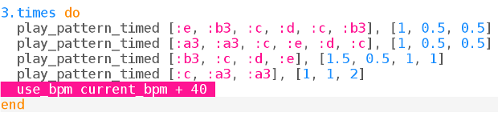

## أسرع!

الأغاني الشعبية الروسية غالبا ما تصبح أسرع وأسرع. قالب تيتريس يفعل هذا أيضا عندما تصل إلى مستويات أعلى في اللعبة.

دعونا نجعل لحنك أسرع وأسرع.

+ يجب أن تبدو التعليمات البرمجية الخاصة بك مثل هذا:
    
    

+ دعونا نضع الموسيقى في حلقة أولاً حتى يتم تشغيلها عدة مرات:
    
    

+ يمكننا استخدام المتغير `current_bpm` لمعرفة ما يتم تعيين bpm حاليا.
    
    أضف خطًا لزيادة نبضة في الدقيقة في كل مرة تكرر فيها الحلقة:
    
    
    
    

      <audio controls preload> <source src="resources/tetris-2.mp3" type="audio/mpeg"> المتصفح الخاص بك لا يدعم عنصر <code>الصوت </code>. </audio>
    

حاول زيادة عدد مرات التكرار لتصبح أسرع وأسرع!