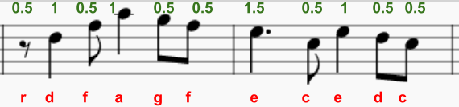
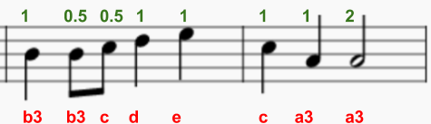

\--- challenge \---

## التحدي: المزيد من اللحن

هل يمكنك برمجة الجزء التالي من اللحن:

يستخدم Sonic Pi ':r' في حالة أقل للراحة (توقف مؤقت) ويمكنك استخدامه مثل الملاحظة.

  <audio controls preload> <source src="resources/tetris-c2.mp3" type="audio/mpeg"> المتصفح الخاص بك لا يدعم عنصر <code>الصوت </code>. </audio>

\--- /challenge \---