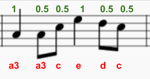

## Programmer begyndelsen

Lad os programmere den første del af melodien i Sonic Pi.

+ Først skal vi vælge en hastighed og en synth for musikken. Den normale hastighed er 60 slag pr. minut (bpm), men dette er ikke hurtigt nok for dette stykke.

    Vælg en tom Buffer i Sonic Pi og tilføj denne kode:

    

+  Her er den første takt af Korobeiniki:

    

    Den viser navnet og længden af noden henholdsvis nedenunder i rødt og ovenover i grønt.

    Musikalske noder har bogstavsnavne fra A-G. For at få flere noder, gentager du bogstaverne for at få flere oktaver (rækker af højere eller lavere noder). Hver oktav starter fra C.

    I Sonic Pi er standarden oktav 4, og b3 betyder b fra oktaven nedenunder.

    Sonic Pi tillader brugen af bogstavsnavne i stedet for tal. Dette hjælper, når man arbejder med musikalsk notation.

    Programmer de første 3 noder af Korobeiniki i Sonic Pi:

    

+ Dette virker, men det kræver ret meget skrivearbejde. Der er en kortere måde at programmere længere melodier: `play_pattern`.

    `play_pattern` giver dig muligheden for at programmere flere noder på en linje.

    Omskriv din kode, så den bruger `play_pattern` til at afspille den første takt:

    

+ Du har nok bemærket, at noderne i den første takt faktisk ikke har den samme længde. Det er helt fint; hvis du ændrer `play_pattern` til `play_pattern_timed`, kan du bestemme, hvor lang hver node skal være.

    De grønne tal viser, hvor mange slag hver node er.

    

    (Hvis du læser musik, er dette stykke i 4/4 tid, og en kvartnode varer et slag, en ottendedelsnode varer et halvt slag, og en halvnode varer to slag)

    `play_pattern_timed` tager en liste af noder og derefter en liste af tider.

    Ændre din `play_pattern` kode til at se således ud:

    

+ Hvis du ikke indtaster nok tider, vil Sonic Pi gentage dem. Denne takt gentager timingen `1, 0.5, 0.5` (en kvartnode, efterfulgt af to ottendedelsnoder), så du kan ændre din kode til:

    

+ Tilføj den næste takt af musikken, hvor timingen er den samme som den forrige.

    

    

    

    <audio controls preload>
      <source src="resources/tetris-1.mp3" type="audio/mpeg">
    Din browser understøtter ikke <code>audio</code> elementet.
    </audio>
    

Begynder melodien at lyde bekendt?
