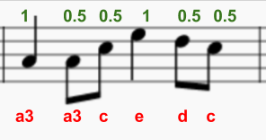
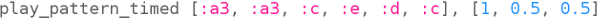

## Codiere den Anfang

Lasse uns nun den ersten Teil des Songs in Sonic Pi codieren.

+ Zuerst lass uns eine Geschwindigkeit und einen Synth für die Musik auswählen. Die normale Geschwindigkeit beträgt 60 Schläge pro Minute (BPM), aber das ist für dieses Stück nicht schnell genug.
    
    Wähle einen leeren Puffer in Sonic Pi und gebe diesen Code ein:
    
    

+ Hier ist die erste Bar von Korobeiniki:
    
    
    
    Es zeigt den Namen der Note unten in rot und die Länge der Note oben in Grün.
    
    Noten haben Buchstaben von A-G. Um mehr Noten zu erhalten, wiederhole die Buchstaben, um mehr Oktaven (Bereiche mit höheren oder niedrigeren Noten) zu erhalten.
    
    In Sonic Pi ist der Standardwert die Oktave 4, b3 bedeutet b aus der darunterliegenden Oktave.
    
    Mit Sonic Pi kannst du Buchstabennamen anstelle von Zahlen verwenden. Dies ist nützlich, wenn du mit Notationen arbeitest.
    
    Codiere die ersten 3 Noten von Korobeiniki in Sonic Pi:
    
    

+ Das funktioniert, aber man muss ziemlich viel tippen. Es gibt eine kürzere Möglichkeit, längere Titel zu programmieren: `play_pattern`.
    
    Mit `play_pattern` kannst Du mehrere Noten in einer Zeile programmieren.
    
    Ersetze deinen Code, um `play_pattern` zu verwenden, um den ersten Takt zu spielen:
    
    

+ Du hast vielleicht bemerkt, dass die Notizen nicht alle gleich lang sind. Wenn du das `play_pattern` in `play_pattern_timed` änderst, kannst du sagen, wie lange jede Note dauert.
    
    Die Zahlen in Grün zeigen viele Schläge, die jede Note hält.
    
    
    
    (Wenn du Musik liest, ist dieses Stück im 4/4-Takt und ein Schritt dauert einen Takt, ein Achtel dauert einen halben Takt und ein Minimum dauert zwei Taktschläge.)
    
    `play_pattern_timed` nimmt eine Liste von Notizen und dann eine Liste von Zeiten.
    
    Ändere deinen `play_pattern` Code wie folgt:
    
    

+ Wenn Du nicht genug Zeit gibst, wird Sonic Pi es wiederholen. Dieser Balken wiederholt das Timing `1, 0,5, 0,5` (Schrittzange, Quaver, Quaver), sodass du deinen Code folgendermaßen ändern kannst:
    
    

+ Füge den nächsten Takt hinzu, das Timing ist für diesen Takt gleich.
    
    
    
    
    
    

    <audio controls preload> 
      <source src="resources/tetris-1.mp3" type="audio/mpeg"> 
    Ihr Browser unterstützt das <code>Audio-</code> Element nicht. 
    </audio>
    

Beginnt dir die Melodie vertraut zu sein?