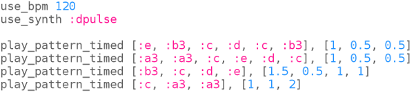

## Schneller!

Russische Volkslieder werden oft schneller und schneller. Das Tetris-Theme-Tune tut dies auch, wenn du zu höheren Leveln im Spiel gelangst.

Lass uns deine Musik schneller und schneller machen.

+ Dein Code sollte jetzt so aussehen:
    
    

+ Lass uns die Musik zuerst in eine Schleife bringen, damit sie mehrmals abgespielt wird:
    
    

+ Wir können die Variable `current_bpm` verwenden, um herauszufinden, worauf die BPM (Beats pro Minute) aktuell eingestellt ist.
    
    Füge eine Zeile hinzu, um die BPM jedes Mal zu erhöhen, wenn du die Schleife wiederholst:
    
    
    
    

      <audio controls preload> <source src="resources/tetris-2.mp3" type="audio/mpeg"> Ihr Browser unterstützt das <code>Audio-</code> Element nicht. </audio>
    

Versuche, die Anzahl der Wiederholungen zu erhöhen, um schneller und schneller zu werden!