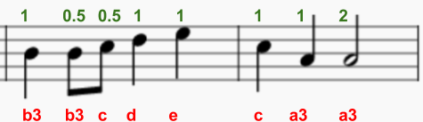

--- challenge ---

## Herausforderung: Mehr von der Melodie

Kannst du den nächsten Teil des Songs programmieren:

Sonic Pi verwendet ': r' in Kleinschreibung für eine Pause (Pause) und du kannst es wie eine Notiz verwenden.

<audio controls preload> 
  <source src="resources/tetris-c2.mp3" type="audio/mpeg"> 
Dein Browser unterstützt das <code>Audio-</code> Element nicht. 
</audio>

--- /challenge ---