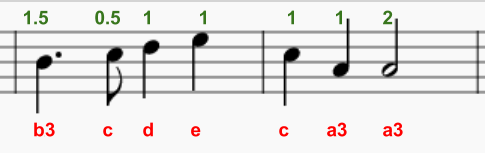

\--- challenge \---

## Desafío: Termina la melodía

Aquí está la música para los siguientes dos compases.

¿Puedes usar `play_pattern_timed` para programarlo?

  <audio controls preload> <source src="resources/tetris-c1.mp3" type="audio/mpeg"> Tu navegador no es compatible con el elemento <code>audio</code>. </audio>

\--- /challenge \---