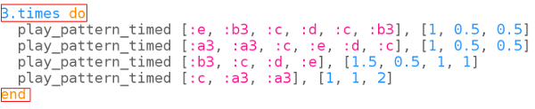

## ¡Más rápido!

Las canciones populares rusas suelen hacerse cada vez más rápidas. La melodía del tema Tetris también lo hace a medida que llegas a niveles más altos en el juego.

Hagamos que tu melodía sea más y más rápida.

+ Tu código debería verse así:
    
    

+ Primero pongamos la música en un bucle para que se reproduzca varias veces:
    
    

+ Podemos utilizar la variable `current_bpm` para averiguar el valor actual del bmp.
    
    Añade una línea para aumentar el bpm cada vez que repitas el bucle:
    
    
    
    

      <audio controls preload> 
       <source src="resources/tetris-2.mp3" type="audio/mpeg"> Tu navegador no es compatible con el elemento <code>audio</code>. 
      </audio>
    

¡Intenta aumentar el número de repeticiones para ir más y más rápido!