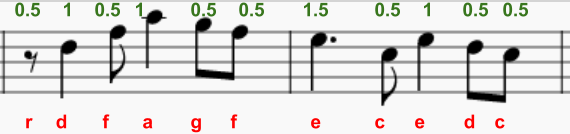
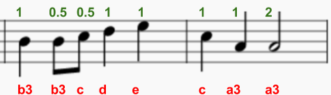

--- challenge ---

## Desafío: Más de la melodía

Puedes programar la siguiente parte de la melodía:

Sonic Pi usa ':r' en minúsculas para un descanso (una pausa) y puedes usarlo como una nota.

  <audio controls preload> 
   <source src="resources/tetris-c2.mp3" type="audio/mpeg"> Tu navegador no es compatible con el elemento <code>audio</code>. 
  </audio>

--- /challenge ---