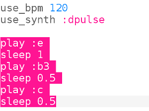
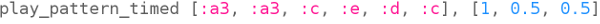

## Code the Beginning

Now let's code the first part of the tune in Sonic Pi.

+ First let's choose a speed and a synth for the music. The normal speed is 60 beats per minute (bpm) but that's not fast enough for this piece.
    
    Choose an empty Buffer in Sonic Pi and add this code:
    
    

+ Here's the first bar of Korobeiniki:
    
    
    
    It shows the name of the note below in red and the length of the note above in green.
    
    Musical notes have letter names from A-G. To get more notes you repeat the letters to get more octaves (ranges of higher or lower notes.) Each octave starts from C.
    
    In Sonic Pi the default is octave 4, b3 means b from the octave below.
    
    Sonic Pi allows you to use letter names instead of numbers. This is useful when you are working with musical notation.
    
    Code the first 3 notes of Korobeiniki in Sonic Pi:
    
    

+ That works but it takes quite a lot of typing. There's a shorter way to program longer tunes: `play_pattern`.
    
    `play_pattern` allows you to program multiple notes in one line.
    
    Replace your code to use `play_pattern` to play the first bar:
    
    

+ You might have noticed that the notes aren't actually all the same length. That's okay, if you change `play_pattern` to `play_pattern_timed` then you can say how long each note lasts.
    
    The numbers in green show many beats each note lasts.
    
    
    
    (If you read music, this piece is in 4/4 time and a crotchet lasts one beat, a quaver lasts half a beat and a minim lasts two beats.)
    
    `play_pattern_timed` takes a list of notes and then a list of times.
    
    Change your `play_pattern` code to look like this:
    
    

+ If you don't give enough times then Sonic Pi will repeat them. This bar repeats the timing `1, 0.5, 0.5` (crotchet, quaver, quaver) so you can change your code to:
    
    

+ Add the next bar of music, the timing is the same for this bar.
    
    
    
    
    
    

      <audio controls preload> <source src="resources/tetris-1.mp3" type="audio/mpeg"> Your browser does not support the <code>audio</code> element. </audio>
    

Is the tune starting to sound familiar?