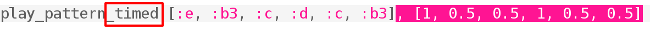

## आरंभ कोड करना

आइए अब हम Sonic Pi में धुन के पहले भाग को कोड करें।

+ आइए पहले हम संगीत के लिए गति और कोई सिंथसाइज़र चुनें। सामान्य गति 60 बीट प्रति मिनट (बीपीएम) होती है लेकिन यह इस रचना के लिए पर्याप्त तेज़ नहीं है।
    
    Sonic Pi में एक खाली बफ़र चुनें और यह कोड जोड़ें:
    
    

+ यहाँ Korobeiniki (कोरोबिनिकी) की पहली पट्टी है:
    
    
    
    इसमें नीचे लाल रंग में स्वर का नाम और ऊपर हरे रंग में स्वर की लंबाई दिखाई देती है।
    
    संगीत के स्वरों के अक्षर नाम A-G तक होते हैं। अधिक स्वर प्राप्त करने के लिए आप अधिक सप्तक (उच्च या निम्न स्वरों की श्रेणियाँ) प्राप्त करने के लिए अक्षरों को दोहराते हैं। प्रत्येक ऑक्टेव (सप्तक) C से शुरू होता है।
    
    Sonic Pi में डिफॉल्ट ऑक्टेव 4 होता है, b3 का मतलब नीचे ऑक्टेव से b है।
    
    Sonic Pi में आप संख्याओं के बजाय अक्षर नामों का उपयोग कर सकते हैं। जब आप संगीत स्वरांकन के साथ काम कर रहे होते हैं तो यह उपयोगी होता है।
    
    Sonic Pi में Korobeiniki के पहले 3 स्वर कोड करें:
    
    

+ यह काम करता है लेकिन इसमें टाइपिंग बहुत करनी पड़ती है। लंबी धुनों को प्रोग्राम करने का एक छोटा तरीका है: `play_pattern`।
    
    `play_pattern` से आप एक पंक्ति में कई स्वरों को प्रोग्राम कर सकते हैं।
    
    पहली पट्टी चलाने के लिए `play_pattern` का उपयोग करने के लिए अपना कोड बदलें:
    
    

+ आपने देखा होगा कि सभी स्वरों की लंबाई वास्तव में एक समान नहीं होती है। यह ठीक है, यदि आप `play_pattern` को `play_pattern_timed` में बदलते हैं तो आप कह सकते हैं कि प्रत्येक स्वर कितने समय तक रहता है।
    
    हरे रंग की संख्याएँ दर्शाती हैं कि प्रत्येक स्वर कितने ताल तक चलेगा।
    
    
    
    (यदि आप संगीत पढ़ते हैं, तो यह रचना 4/4 समय में है और एक पादस्वर एक बीट तक रहता है, एक अष्टमांश आधा बीट और एक मिनिम दो बीट तक रहता है।)
    
    `play_pattern_timed` पहले स्वरों की सूची लेता है और फिर समय की सूची।
    
    इस तरह का दिखाई देने के लिए अपने `play_pattern` का कोड बदलें:
    
    

+ यदि आप पर्याप्त समय नहीं देते हैं तो Sonic Pi उन्हें दोहराएगा। यह पट्टी समय `1, 0.5, 0.5` (पादस्वर, अष्टमांश, अष्टमांश) को दोहराती है ताकि आप अपना कोड इस प्रकार बदल सकें:
    
    

+ संगीत की अगली पट्टी जोड़ें, इस पट्टी के लिए उतना ही समय है।
    
    
    
    
    

<audio controls preload> 
  <source src="resources/tetris-1.mp3" type="audio/mpeg"> 
आपका ब्राउज़र <code>audio</code> तत्व का समर्थन नहीं करता है। 
</audio>

क्या धुन किसी परिचित ध्वनि जैसी लगने लगी है?
