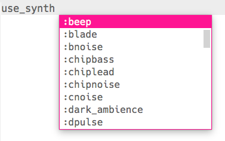

\--- challenge \---

## चुनौती: धुन को मिलाना

किसी अलग सिंथसाइज़र का उपयोग करके धुन के बजने के तरीके को बदलने की कोशिश करें।

आप `use_synth [space]` टाइप करके आपको उपलब्ध सिंथसाइज़रों की एक सूची देख सकते हैं और जो सूची दिखाई दे उसमें से चयन कर सकते हैं।

\--- /challenge \---