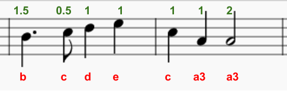

\--- 도전 \---

## Challenge: Finish the tune

Here's the music for the next two bars.

Can you use `play_pattern_timed` to program it?

  <audio controls preload> <source src="resources/tetris-c1.mp3" type="audio/mpeg"> Your browser does not support the <code>audio</code> element. </audio>

<0>for</0>, <0>forward()</0>, <0>penup()</0> and <0>pendown()</0>를 사용해 보세요.