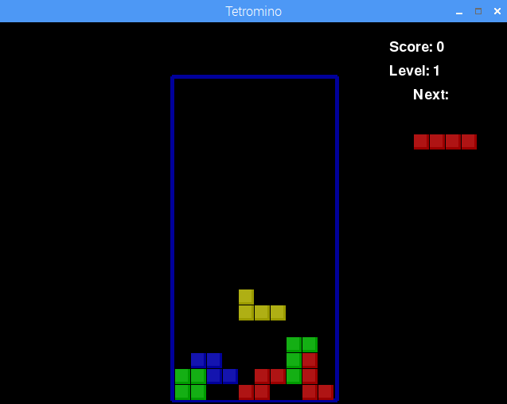

## Inleiding

In dit project leer je hoe je muzieknoten in Sonic Pi programmeert zodat je bladmuziek in code kunt veranderen. Je maakt je eigen mix van het muzikale thema van Tetris.

  Klik op de afspeelknop hieronder om te horen hoe de muziek klinkt: <audio controls preload> <source src="resources/korobeiniki.mp3" type="audio/mpeg"> Je browser ondersteunt het element <code>audio</code> niet. </audio>

Tetris is een populair computerspel dat in 1984 is gemaakt door de Russische programmeur Alexey Pajitnov. Veel versies van Tetris maken gebruik van de muziek 'Korobeiniki', een Russische volksdans.

Als je een Raspberry Pi-computer gebruikt, kun je de muziek horen door het Tetromino spel te spelen. Je kunt het vinden door 'Spelletjes' te kiezen in het menu en vervolgens 'Python Games'. Speel niet te lang! Je moet coderen.

De vormen van de Tetris stukken worden tetrominoes genoemd - de 2D vormen die kunnen worden gemaakt met 4 vierkanten.

### Aanvullende informatie voor clubleiders

Als je dit project wilt afdrukken, gebruik dan de [printervriendelijke versie](https://projects.raspberrypi.org/en/projects/tetris-theme/print).

## \--- collapse \---

## title: Opmerkingen voor docenten

## Inleiding:

In dit project programmeren kinderen het Tetris-thema met behulp van muzikale noten en werken ze met muzikale notatie.

## Bronnen

De link 'Projectmaterialen' voor dit project bevat de volgende bronnen:

##### Clubleider bronnen

Je kunt een voltooide versie van dit project vinden door te klikken op de link 'Projectmaterialen' voor dit project, dat het volgende bevat:

* kobeiniki.txt
* kobeiniki.mp3

## Leerdoelen

* Muziek programmeren met letternamen. 
* Gebruik `play_pattern_timed` in Sonic Pi.

Dit project behandelt elementen uit de volgende onderdelen van het [Raspberry Pi Digital Making Curriculum](http://rpf.io/curriculum):

* [Gebruik basale programmeerconstructies om eenvoudige programma's te maken.](https://www.raspberrypi.org/curriculum/programming/creator)

## Uitdagingen

* "Maak de melodie af" - programmeer meer muziek uit geannoteerde muzikale notatie.
* "Mix de melodie" - experimenteer met het gebruik van verschillende synths.
* "Meer van de melodie" - programmeer meer muziek uit geannoteerde muzieknotatie en gebruik `:r` voor pauzes.
* "Meer muziek" - Zoek online eenvoudige bladmuziek en programmeer deze.

## Veelgestelde vragen (faq)

\--- /collapse \---

## \--- collapse \---

## title: Projectmaterialen

## Club leider bronnen

* [Downloadbaar voltooid Sonic Pi-project](resources/korobeiniki.txt)
* [Downloadbaar voltooid project mp3-bestand](resources/korobeiniki.mp3)

\--- /collapse \---