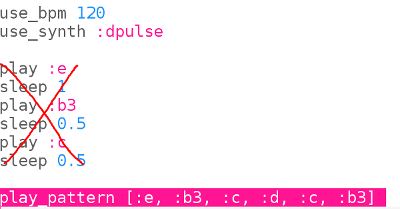

## Codeer het begin

Laten we nu het eerste deel van de melodie in Sonic Pi coderen.

+ Laten we eerst een snelheid en een synth voor de muziek kiezen. De normale snelheid is 60 tellen per minuut (bpm), maar dat is niet snel genoeg voor dit stuk.
    
    Kies een lege buffer in Sonic Pi en voeg deze code toe:
    
    

+ Hier is de eerste maat van Korobeiniki:
    
    
    
    Het toont onderaan de naam van de noot in rood en bovenaan de lengte van de noot in groen.
    
    Muzikale noten hebben letternamen van A-G. Om meer noten te krijgen herhaal je de letters om meer octaven te krijgen (bereiken van hogere of lagere noten). Elke octaaf begint bij C.
    
    In Sonic Pi is de standaard octaaf 4, b3 betekent b van een octaaf lager.
    
    Met Sonic Pi kun je letternamen gebruiken in plaats van cijfers. Dit is handig als je met een muzieknotatie werkt.
    
    Codeer de eerste 3 noten van Korobeiniki in Sonic Pi:
    
    

+ Dat werkt, maar het kost heel veel typwerk. Er is een kortere manier om langere nummers te programmeren: `play_pattern`.
    
    `play_pattern` stelt je in staat om meerdere noten in één regel te programmeren.
    
    Vervang je code om `play_pattern` te gebruiken om de eerste maat te spelen:
    
    

+ Je hebt misschien gemerkt dat de noten niet allemaal dezelfde lengte hebben. Dat is oké, als je `play_pattern` wijzigt in `play_pattern_timed` dan kun je zeggen hoe lang elke noot duurt.
    
    De getallen in het groen tonen hoeveel tellen elke noot duurt.
    
    
    
    (Als je muziek leest, is dit stuk in 4/4-maat en duurt een kwartnoot één tel, een achtste noot een halve tel en een halve noot twee tellen.)
    
    `play_pattern_timed` krijgt een lijst met noten en vervolgens een lijst met tijden.
    
    Wijzig je `play_pattern` code om er zo uit te zien:
    
    

+ Als je niet genoeg tijden geeft dan zal Sonic Pi ze herhalen. Deze balk herhaalt de timing `1, 0.5, 0.5` (kwartnoot, achtste noot, achtste noot) zodat je je code kunt wijzigen in:
    
    

+ Voeg de volgende maat aan de muziek toe, de timing is hetzelfde voor deze maat.
    
    
    
    
    
    

    <audio controls preload> 
     <source src="resources/tetris-1.mp3" type="audio/mpeg"> Je browser ondersteunt het element <code>audio</code> niet. 
    </audio>
    

Klinkt de melodie bekend?