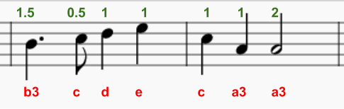

\--- challenge \---

## Challenge: Finish the tune

Here's the music for the next two bars.

Can you use `play_pattern_timed` to program it?

  <audio controls preload> <source src="resources/tetris-c1.mp3" type="audio/mpeg"> Je browser ondersteunt het element <code>audio</code> niet. </audio>

\--- /challenge \---