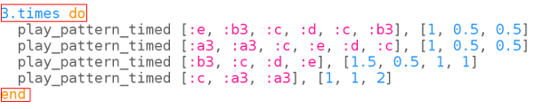

## Faster!

Russian folk songs often get faster and faster. The Tetris theme tune does this too as you get to higher levels in the game.

Let's make your tune go faster and faster.

+ Your code should now look like this:
    
    

+ Let's put the music into a loop first so that it plays multiple times:
    
    

+ We can use the variable `current_bpm` to find out what the bpm is currently set to.
    
    Add a line to increase the bpm every time you repeat the loop:
    
    
    
    

      <audio controls preload> <source src="resources/tetris-2.mp3" type="audio/mpeg"> Your browser does not support the <code>audio</code> element. </audio>
    

Try increasing the number of repeats to go faster and faster!