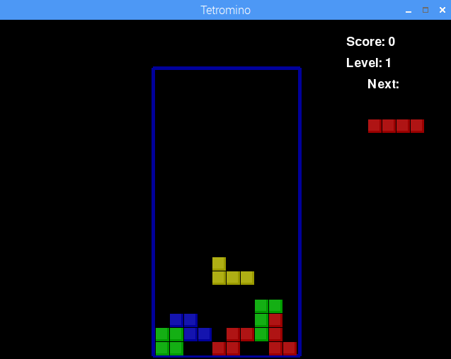

## 简介

In this project you will learn how to program musical notes in Sonic Pi so that you can turn sheet music into code. You'll create your own mix of the Tetris theme tune.

  Click the play button below to hear how the music will sound: <audio controls preload> <source src="resources/korobeiniki.mp3" type="audio/mpeg"> Your browser does not support the <code>audio</code> element. </audio>

Tetris is a popular computer game created in 1984 by Russian coder Alexey Pajitnov. Many versions of Tetris use the music 'Korobeiniki', a Russian folk dance.

If you're using a Raspberry Pi computer then you can hear the music by playing the Tetromino game. You can find it by choosing 'Games' from the menu and then 'Python Games'. Don't play for too long! You've got coding to do.

The shapes of the Tetris pieces are called tetrominoes - the 2D shapes that can be made with 4 squares.

### 俱乐部导师的附加信息

如果您需要打印此项目，请使用[合适打印版本](https://projects.raspberrypi.org/en/projects/tetris-theme/print) 。

## \--- collapse \---

## title: 俱乐部导师说明

## 简介

In this project, children will program the Tetris Theme using musical notes and work with musical notation.

## 资源

The 'Project Materials' link for this project contains the following resources:

##### Club leader Resources

You can find a completed version of this project by clicking the 'Project Materials' link for this project, which contains:

* kobeiniki.txt
* kobeiniki.mp3

## 学习目标

* Programming music using letter names. 
* Using `play_pattern_timed` in Sonic Pi.

该项目涵盖了[Raspberry Pi数字制作课程](http://rpf.io/curriculum)的以下内容 ：

* [利用基本编程结构创建简单程序。](https://www.raspberrypi.org/curriculum/programming/creator)

## 挑战

* "Finish the tune" - Program more music from annotated musical notation.
* "Mix the tune" - Experiment with using different synths.
* "More of the tune" - Program more music from annotated musical notation and using `:r` for rests.
* "More music" - Find simple sheet music online and program it.

## 常见问题

\--- /collapse \---

## \--- collapse \---

## title: 项目资源

## 俱乐部负责人资源

* [Downloadable completed Sonic Pi project](resources/korobeiniki.txt)
* [Downloadable completed project mp3 file](resources/korobeiniki.mp3)

\--- /collapse \---